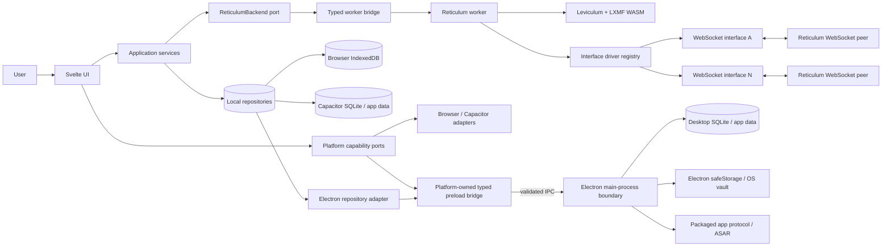
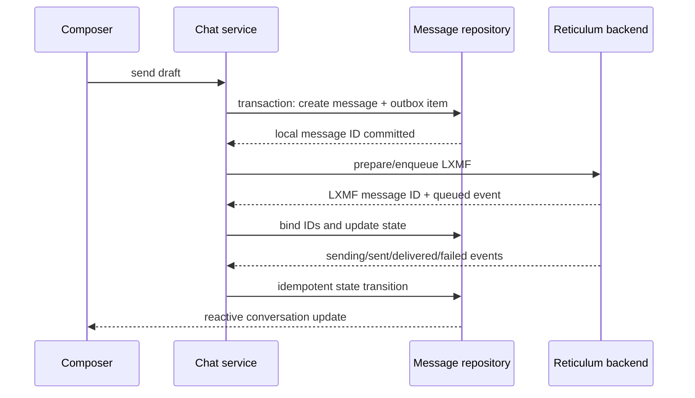

# Retivum architecture

| Field | Value |
| --- | --- |
| Status | Current architecture baseline |
| Last updated | 2026-07-21 |
| Product name | **Retivum — A Reticulum Messenger** |
| Application ID | `de.nilu96.retivum` |
| License | `AGPL-3.0-or-later` |
| Initial release | Svelte application with LXMF chat, NomadNet client, and network settings |
| Native targets | iOS, Android, macOS, Windows, Linux |
| Browser target | Current Chrome-class browsers; other modern browsers where practical |

This document records durable product boundaries and system design. Current implementation status and development commands live in `README.md`; repository-specific working guidance belongs in `AGENTS.md`. Superseding architecture decisions should be captured as short ADRs under `docs/adr/` and linked back here.

## 1. Outcome and guiding decisions

Build **Retivum — A Reticulum Messenger** as one local-first Svelte user interface and package the same core compiled asset graph for every target, with a browser profile that adds PWA files and a native profile that excludes service-worker registration:

- **Svelte 5, TypeScript, and Vite** for a client-only single-page application.
- **Capacitor 8** for iOS and Android.
- A direct, application-owned **Electron** shell for macOS, Windows, and Linux.
- A **PWA/service worker build** for browsers.
- The existing **Leviculum + LXMF WebAssembly bundle** as the initial Reticulum engine on all targets.
- A dedicated worker, typed runtime facade, interface-driver registry, and storage ports between the generated WASM and the Svelte UI.
- An application-owned localization boundary with bundled catalogs and no hardcoded user-facing component text.
- Repository ports backed by IndexedDB in browsers and durable native SQLite/file storage in packaged applications.
- No application backend, runtime CDN, remote fonts, analytics endpoint, or web-server dependency after the complete app bundle has been loaded.

Capacitor itself officially targets iOS, Android, and Web. Retivum uses a direct Electron shell so the privileged surface remains limited to the device-selection and raw-TCP operations the application actually needs. The old `@capacitor-community/electron` package is unmaintained and is not used; the very new `@capawesome/capacitor-electron` is not required by the selected shell.

“Native” in this plan means an installable, signed application using a platform web runtime and native capabilities: system WebViews on mobile and bundled Chromium in Electron. It does not mean rewriting the UI with AppKit, WinUI, GTK, SwiftUI, or Jetpack Compose.

## 2. Requirements and boundaries

### 2.1 Required for the first usable release

| Area | Requirement |
| --- | --- |
| Packaging | Installable applications for all five native platforms and a browser build from one UI codebase |
| Local operation | All HTML, CSS, JavaScript, WASM, icons, fonts, and fallback content are bundled or pre-cached |
| Chat | Browse all chats with recent-message previews, every saved contact, and every heard LXMF chat-destination announce; create/select conversations, name contacts, send and receive messages, persist history, show delivery state, and recover a pending outbox |
| NomadNet | Navigate to a destination/path, request content over Reticulum, safely render the supported markup subset, and provide history/bookmarks |
| Settings | Generate, import, export, rename, activate, deactivate-by-switching, and remove managed identities; enable/disable transport mode; inspect local data/diagnostics |
| Interfaces | First run has no interfaces; add, edit, enable, disable, and delete multiple persistent interface definitions whose enabled state survives restart |
| Interfaces | WebSocket is universal; RNode uses BLE on iOS/Android and supported browsers or Web Serial on desktop/supported browsers; raw TCP and UDP use pinned Capacitor plugins on mobile and allowlisted `node:net`/`node:dgram` IPC bridges in Electron |
| Adaptive UI | Persistent left navigation sidebar on desktop and a safe-area-aware bottom tab bar on mobile, with mobile single-pane and desktop master-detail content built from the same components |
| Accessibility | Keyboard navigation, visible focus, semantic controls, screen-reader names, reduced-motion support, and WCAG AA contrast |
| Localization | All labels, messages, validation, errors, notifications, accessibility text, and formatted dates/numbers use localization keys and locale-aware formatters; English is bundled initially and no catalog is downloaded at runtime |

### 2.2 Explicit interpretation of “no web server”

- A packaged Capacitor or Electron application loads assets embedded in the application. A platform may expose those assets through an internal/custom origin; it is not an external daemon or deployable server.
- The browser build needs an HTTP(S) origin for its first load and service-worker installation. After the full pre-cache succeeds, it can launch while the origin server is unreachable or the device is offline. Its registration and storage remain bound to that origin and may be evicted. Opening `index.html` directly through `file://` is not a supported deployment mode because ES modules, WASM, storage origins, and service workers behave inconsistently there.
- LXMF communication still requires a configured Reticulum connection. That may be a WebSocket endpoint, an RNode radio, or a native TCP/UDP endpoint according to platform capabilities. This is a network dependency, but not an application web backend.
- No feature may silently depend on a REST/GraphQL application API. All user and runtime state is local.
- The UI and queued data remain available when no interface is connected. Messages stay queued until a route becomes available or the user cancels them.
- A fresh installation creates its default identity but no interface definition and makes no network connection. After a user adds an interface, both its configuration and enabled/disabled state persist; every enabled interface automatically attempts to reconnect when Retivum starts.
- Retivum does not ship a default or built-in WebSocket bridge address. Each endpoint is an ordinary persistent Reticulum interface configured by the user.

### 2.3 Platform lifecycle limitation

Web pages and mobile applications are not reliable always-on routers. Browsers suspend or terminate workers, and mobile operating systems heavily limit background execution. The product must describe transport mode honestly:

| Platform | Initial transport-mode promise |
| --- | --- |
| Browser | Works only while the page is active; not a dependable network transport node |
| iOS/Android | Works while the application is in the foreground; background continuation is not promised |
| Desktop | While transport is enabled, works while the Electron process and retained window are running, including minimized/hidden operation with `backgroundThrottling` disabled; OS sleep, explicit quit, crash, or process termination stops it |

Transport mode may still be toggled on every platform, but the UI must show the applicable capability note. On desktop, closing the last window while transport mode is enabled keeps the Electron process and a hidden window alive; the tray/menu provides an explicit Quit action. When transport mode is disabled, Close exits normally after a final snapshot. An always-on boot service that survives logout, process termination, or operating-system sleep is a separate daemon design and remains out of scope.

### 2.4 Deferred unless promoted during review

- Further interface types beyond WebSocket, RNode, TCP, and UDP
- Group chat, voice/video, reactions, and message editing
- General file attachments and media processing
- Hosting a NomadNet node or serving pages
- Full background service/daemon operation
- Push notifications that depend on a central service
- Cross-device synchronization or account service
- Arbitrary browser TCP/UDP, serial, Bluetooth, or radio access
- Plugins or scripts supplied by NomadNet pages

## 3. Protocol engine

Retivum ships generated `wasm-bindgen` output from Leviculum as a local application asset. The generated files are immutable build inputs: changes originate in Leviculum, are rebuilt through its toolchain, and enter Retivum with recorded source provenance, license metadata, toolchain/profile/features, API version, and generated hashes.

The generated API provides:

- `ReticulumNode` construction with identity, persistent state, and `transportEnabled`.
- Interface registration, receive, online/offline state, runtime `tick()`, and a next deadline.
- Runtime actions/events and a dirty-persistence signal.
- LXMF enablement, announce, message preparation/queue/cancel, propagation client, stamps, paper URI, and incoming/outgoing state events.
- Generic link, resource, and request primitives needed by a future NomadNet client.
- Export/import of persistent Reticulum state.

The host architecture accounts for these API constraints:

1. `transportEnabled` is constructor-only. Changing it requires a controlled node restart unless the WASM API is extended.
2. Interfaces can be added and toggled online, but no remove/update method is exposed. Editing or deleting a live interface also requires a controlled node restart.
3. Stable application interface IDs must be separate from runtime numeric interface indexes returned by `addInterface()`.
4. WebSocket address/TLS fields and automatic reconnection are owned by the host interface driver, not WASM.
5. Persistent state includes identity private material. Exported snapshots cannot be treated as ordinary non-sensitive settings.
6. WASM storage is memory-backed. The host persists exported snapshots through the platform repository.
7. CPU-heavy stamp work and frequent ticks must not block rendering.
8. The WASM bundle exposes Reticulum primitives, not a complete NomadNet client.
9. One `ReticulumNode` owns one identity and one LXMF router; concurrent active identities would require multiple runtime owners and are deferred.

## 4. Platform packaging

### 4.1 Target matrix

| Target | Shell | Asset delivery | Initial protocol engine | Local database | Key protection |
| --- | --- | --- | --- | --- | --- |
| Browser | Static PWA | HTTPS first load, then service-worker pre-cache | WASM worker | IndexedDB | Origin-bound storage with explicit warning; no passphrase in v1 |
| iOS | Capacitor | Native-profile assets copied into the signed app | WASM worker | Native SQLite/file repository | Keychain-backed vault adapter |
| Android | Capacitor | Native-profile assets copied into the signed app | WASM worker | Native SQLite/file repository | Keystore-backed vault adapter |
| macOS | Direct Electron | Native-profile assets packaged in app resources/ASAR | WASM worker | Native SQLite/file repository | Electron `safeStorage` backed by Keychain |
| Windows | Direct Electron | Native-profile assets packaged in app resources/ASAR | WASM worker | Native SQLite/file repository | Electron `safeStorage` backed by OS cryptography |
| Linux | Direct Electron | Native-profile assets packaged in app resources/ASAR | WASM worker | Native SQLite/file repository | Electron `safeStorage`; detect and reject weak fallback for identity keys |

The initial backend is deliberately the same WASM implementation everywhere. A later Electron utility/main-process or native backend may be introduced for non-WebSocket interfaces, daemon-like desktop routing, or performance, but only behind the same `ReticulumBackend` port.

The native package namespace is `de.nilu96.retivum`: use it as Capacitor's `appId`, the resulting Android `applicationId` and iOS bundle identifier, and Electron's `appId`. A web app manifest `id` is an origin-relative URL, so the PWA uses `/retivum` rather than treating the reverse-domain native identifier as a URL; build metadata may still record the native namespace.

### 4.2 Desktop shell decision

| Option | Benefits | Costs/risks | Decision |
| --- | --- | --- | --- |
| Direct Electron | Uses the official Electron runtime with full control over main/preload/renderer security and the smallest required platform bridge | The project must implement and maintain its own desktop adapters, packaging, and sync conventions | **Selected and minimally implemented** |
| `@capawesome/capacitor-electron` | Capacitor-shaped sync and plugin conventions | Very new platform with little production history and a broader generated bridge than currently needed | Not selected; may be re-evaluated only through a new ADR |
| `@capacitor-community/electron` | Historical Capacitor-shaped API | Explicitly unmaintained; latest release is too old for the current baseline | Rejected |

The user has selected Electron and Tauri is not an option for this project. No application feature may import Electron APIs directly. Features call narrow ports such as byte transports, `SecretVault`, `Lifecycle`, `FileExport`, and `ExternalNavigation`; platform adapters implement them. Mobile adapters may use compatible Capacitor plugins behind those ports.

### 4.3 Electron process and asset model

The repository owns the small Electron main/preload boundary. It loads the built local asset graph, provides localized RNode device selection, and exposes raw sockets through validated allowlisted calls. It deliberately does not expose a generic Capacitor or Electron bridge.

- The Electron **main-process boundary** owns application lifecycle, windows/tray, single-instance handling, the local asset protocol, native database/vault access, and narrowly validated plugin/IPC handlers.
- The application-owned **preload/bridge** exposes explicit, typed methods. It never exports raw `ipcRenderer`, filesystem, shell, process, or database objects.
- The **renderer** runs only the locally packaged Svelte application with `nodeIntegration: false`, `contextIsolation: true`, `sandbox: true`, and `webSecurity: true`.
- The **Reticulum dedicated worker** remains renderer-owned for maximum reuse. It owns WASM and WebSockets but has no Node.js or unrestricted native access.
- Production packages load assets through a registered secure local scheme (for example `app://`) with correct JavaScript/WASM MIME types and a stable origin. No localhost server is started in production.
- While transport mode is enabled, the app applies `backgroundThrottling: false` through the platform's window-created hook and retains a hidden window. Closing the last visible window hides the app to the tray/menu instead of quitting; explicit Quit performs a final snapshot and clean shutdown. With transport disabled, default throttling remains in force and Close exits normally.
- Deny unexpected navigation, new-window creation, permission requests, and downloads. Validated external links open through the narrow external-navigation adapter.

Packaging work must preserve these security and lifecycle settings. Any proposed desktop-platform replacement requires a new ADR and must update this architecture, source tree, CI commands, package/license inventories, and packaging tests rather than weakening the requirements.

### 4.4 Static routing

Use hash-based client routing for the initial SPA:

- `/#/chat`
- `/#/chat?scope=chats|contacts|announces`
- `/#/chat/:conversationId`
- `/#/nomadnet`
- `/#/settings`

This avoids server rewrite rules and native custom-protocol deep-link failures. Application-level deep links can later be translated into these routes by the platform adapter.

## 5. System architecture



### 5.1 Layer responsibilities

| Layer | Responsibilities | Must not contain |
| --- | --- | --- |
| Presentation | Svelte components, adaptive layout, forms, view state, accessibility | Direct WASM, socket, database, Capacitor, or Electron calls |
| Application | Chat, NomadNet, settings, startup, outbox, and navigation use cases | DOM or platform-shell APIs |
| Domain | Typed entities, state machines, validation rules, value objects | Generated `any` values or persistence records |
| Ports | Contracts for backend, repositories, vault, lifecycle, export, notifications | Implementation details |
| Infrastructure | WASM facade, worker bridge, WebSocket driver, IndexedDB/native repositories, safe markup parser | Feature-specific UI |
| Platform | Browser, Capacitor, and Electron adapters plus capability detection | Scattered business rules |

Dependency direction is inward: adapters know ports, but domain/application code does not know adapters.

### 5.2 Core ports

The exact TypeScript API will be refined during the contract spike, but it should resemble:

```ts
interface ReticulumBackend {
  start(config: NodeConfig, identity: ActiveIdentityMaterial): Promise<void>;
  stop(): Promise<void>;
  applyConfig(config: NodeConfig): Promise<ApplyResult>;
  switchIdentity(identity: ActiveIdentityMaterial): Promise<ApplyResult>;
  observe(): ReadableStream<ReticulumEvent>;
  sendLxmf(command: SendLxmfCommand): Promise<MessageId>;
  cancelLxmf(messageId: MessageId): Promise<void>;
  announceDelivery(options: AnnounceOptions): Promise<void>;
  request(command: ReticulumRequest): Promise<ReticulumResponse>;
  getDiagnostics(): Promise<RuntimeDiagnostics>;
}

interface InterfaceDriver<TConfig extends InterfaceConfig> {
  connect(config: TConfig, runtimeIndex: number): Promise<void>;
  send(packet: Uint8Array): Promise<void>;
  setEnabled(enabled: boolean): Promise<void>;
  close(): Promise<void>;
}
```

Generated WASM values are decoded and runtime-validated at the infrastructure boundary. UI code only receives app-owned discriminated unions. Unknown events are logged safely and do not crash the worker.

## 6. Reticulum runtime

### 6.1 Worker ownership

One dedicated module worker owns all mutable Reticulum state:

- WASM module and `ReticulumNode`
- LXMF router instance/state
- Tick/deadline scheduler
- Runtime interface-index map
- WebSocket drivers and platform-interface proxy drivers
- Runtime event normalization
- Snapshot export coordination

Keeping a single owner avoids races between UI components and keeps cryptographic/stamp work off the rendering thread. The UI communicates through structured messages; binary values use transferable `ArrayBuffer`s where safe.

In Electron this is still an ordinary sandboxed Chromium module worker. It receives no Node.js or Electron globals; database, vault, file, tray, and lifecycle capabilities remain behind the renderer adapter → typed preload → validated main-process IPC boundary.

### 6.2 Startup sequence

```mermaid
sequenceDiagram
    participant UI as Svelte app
    participant DB as Local repositories
    participant W as Runtime worker
    participant R as WASM node
    participant I as Interface drivers

    UI->>DB: Load settings, identity registry, interfaces, active identity snapshot
    DB-->>UI: Versioned startup state; zero or more interfaces
    UI->>W: start(NodeConfig, active identity + snapshot)
    W->>W: Load bundled WASM bytes
    W->>R: construct(identity/state, transportEnabled)
    W->>R: enableLxmf(options)
    loop persisted enabled interface definitions
        W->>R: addInterface(generic options)
        R-->>W: runtime interface index
        W->>I: connect(type-specific config, index)
    end
    W->>R: tick()
    W-->>UI: ready + normalized status snapshot
```

Startup is idempotent. On first run, identity initialization creates and persists one generated record labelled “Default identity”; the interface loop is empty and no socket is opened. On later runs, each saved enabled interface reconnects automatically, while disabled records remain disabled. A failed interface does not prevent offline history or the other interfaces from loading.

### 6.3 Tick/action/event loop

After every command, inbound packet, socket-state change, or scheduled deadline:

1. Call the relevant WASM operation.
2. Process each returned `WasmOutput` exactly once and drain its actions/events in order. `addInterface()` is the exception: it returns only a runtime index.
3. Route `send` actions to the matching live interface driver.
4. Normalize and publish events to application services.
5. Treat `nextDeadlineMs` as the current artifact's absolute Unix-epoch millisecond deadline. Schedule `max(0, deadline - Date.now())`, clamp it to the platform timer limit, and re-read/re-check the deadline when the timer fires; retain a contract test so an upstream semantic change is caught.
6. If state is dirty, request a debounced durable snapshot. Critical state transitions additionally request an immediate snapshot.
7. Clear the WASM dirty flag only after durable storage acknowledges success.

Apply backpressure limits to worker commands, UI events, logs, and outbound socket buffers. The browser WebSocket API does not provide true stream backpressure; inspect `bufferedAmount`, pause runtime sends above a high-water mark, and fail/reconnect on a bounded timeout.

### 6.4 Controlled restart

Changing the active identity, transport mode, deleting an interface, or editing fields that cannot be updated in place uses this sequence:

1. Validate and save a pending desired configuration transactionally without replacing the active last-known-good record.
2. Stop accepting new send commands; the UI remains readable.
3. Export and durably store the latest WASM/LXMF snapshot.
4. Close interface drivers and stop the scheduler.
5. Recreate the node from the selected identity's private key and identity-bound snapshot plus the new configuration.
6. Re-add enabled interfaces and resume the outbox.
7. On success, promote the pending configuration to active. On failure, discard/retain it as an editable draft and restore the last-known-good runtime.

The settings screen labels such changes “Restart network engine” and never implies an operating-system/application restart.

### 6.5 Runtime state machine

`stopped → starting → ready ↔ degraded → restarting → ready → stopping → stopped`

`failed` is entered only when the core cannot initialize or restore. Individual interface failures produce `degraded`, not `failed`.

### 6.6 Electron lifecycle recovery

- Keep the renderer and its worker alive in a hidden/minimized `BrowserWindow` with background throttling disabled while transport is enabled.
- Transport adapters own disconnect detection and reconnection; the renderer does not classify pause/resume sessions. Every interface emits one targeted LXMF announce on its first online transition in a runtime. Later online transitions follow the persisted **Announce after reconnecting** option of that individual interface and remain targeted to that interface. The option defaults to enabled for new interfaces and for existing configurations that predate the option; users can override it in the interface's advanced settings. Manual and scheduled announces remain broadcasts across all online interfaces.
- Handle Electron renderer termination/crash by closing orphaned interface state, recreating the window/worker, restoring the last verified snapshot, and replaying only idempotent pending commands.
- Explicit Quit stops new sends, stores a final verified snapshot, closes interfaces, and exits. A timeout prevents an unresponsive runtime from trapping the user indefinitely.
- If a future requirement must survive renderer/window destruction, first prove the generated WASM and WebSocket driver in an Electron `utilityProcess` and implement it as another `ReticulumBackend`. Never move CPU-heavy protocol work onto the Electron main event loop.

### 6.7 Identity registry and activation

The initial engine supports one identity per `ReticulumNode`, so Retivum maintains many durable identity records but exactly one active identity at a time. “Inactive” means safely stored and selectable, not deleted. Running several identities concurrently would require one isolated node/LXMF router and snapshot loop per identity plus deliberate interface fan-out; that is a later architecture decision.

```ts
interface ManagedIdentity {
  id: string;                    // stable application UUID
  schemaVersion: 1;
  displayName: string;           // sole user-visible name and LXMF announce name
  identityHash: Uint8Array;
  publicKey: Uint8Array;
  encryptedPrivateKeyRef: string;
  encryptedSnapshotRef: string;
  createdAt: string;
  updatedAt: string;
}

interface IdentitySelection {
  activeIdentityId: string;      // references exactly one ManagedIdentity
}
```

- A fresh profile generates one identity named **Anonymous**, marks it active, persists its protected private key/snapshot according to the platform policy, and creates its LXMF delivery destination. It does not create an interface.
- **Add identity** supports generating a new identity or importing the standard raw 64-byte Reticulum private identity format (`32-byte X25519 private key || 32-byte Ed25519 private seed`). Raw files carry no display name, so imports are named **Imported Identity** and remain inactive until the user explicitly selects **Set active**. Compatible Retivum backups retain their embedded display name. Retivum also retains import compatibility with its earlier versioned JSON private-key backup.
- Activating another identity stores the current identity's critical snapshot, pauses its outbox, closes drivers, rebuilds the node/LXMF router with the selected identity, and reconnects the same enabled interface definitions. Failure rolls back to the previously active identity and snapshot.
- Identity-specific conversations, contacts, announces, drafts, outbox items, propagation preferences, and runtime snapshots are queried by `identityId`. Pending messages belonging to an inactive identity remain queued and cannot be sent under another identity.
- The manager provides rename, announce, export/backup, set active, and remove actions. The LXMF display name is the identity's only user-visible name; changing it does not change the cryptographic identity hash. Older persisted records may retain a compatibility label field, but it mirrors the display name and is never shown as a second name.
- **Anonymous** is stored as the generated identity's initial display-name value, not recomputed from the current locale. Changing language later must not silently change what that identity announces; the user may edit it explicitly.
- Removing an inactive identity requires confirmation and backup guidance. Removing the active identity first requires selecting a replacement. The final identity cannot be removed unless Retivum atomically generates/imports and activates a replacement.
- Removal deletes private/runtime material and cancels identity-bound pending operations. Existing local chat history may be retained as clearly archived read-only history or deleted through a separate explicit choice; it is never silently reassigned to another identity.

## 7. Extensible interface model

### 7.1 Persisted configuration

Use a versioned discriminated union. Runtime status is separate and is never written into configuration records.

```ts
// Persisted app-level values; the Reticulum adapter owns the tested core-string mapping.
type InterfaceMode =
  | 'full'
  | 'accessPoint'
  | 'pointToPoint'
  | 'roaming'
  | 'boundary'
  | 'gateway';

interface InterfaceBase {
  id: string;                 // application UUID, stable across restarts
  schemaVersion: 2;           // v2 removes user-configurable reconnect policy
  type: string;
  name: string;
  enabled: boolean;
  mode: InterfaceMode;
  hwMtu?: number;
  bitrateBps?: number;
  localClient?: boolean;
  ingressControl?: boolean;
  maxAirtimeMs?: number;
}

interface WebSocketInterfaceConfig extends InterfaceBase {
  type: 'websocket';
  connection: {
    scheme: 'ws' | 'wss';
    host: string;
    port?: number;             // blank means scheme default
    path: string;              // starts with '/'
    query?: string;            // optional, never contains credentials
  };
  subprotocols?: string[];
}

interface UdpInterfaceConfig extends InterfaceBase {
  type: 'udp';
  connection: {
    listenHost: string;
    listenPort: number;
    forwardHost: string;
    forwardPort: number;
  };
}

type InterfaceConfig = WebSocketInterfaceConfig | RNodeInterfaceConfig | TcpInterfaceConfig | UdpInterfaceConfig;
```

These are canonical application values, not generated WASM types. The facade maps them to the Python-compatible strings accepted by Leviculum and contract-tests every value. Existing configurations without a recognized mode migrate to `full`. The interface editors expose the mode in a shared Advanced settings disclosure that is collapsed by default.

### 7.2 Registry-driven UI and runtime

Each interface type registers one descriptor containing:

- type identifier and schema version
- localized title/description message keys, icon, and platform capabilities
- default configuration
- validation and migration functions
- Svelte editor component
- driver factory
- redacted diagnostic serializer

The arrow on the **Add interface** button opens a menu populated from the interface-type descriptor registry. The menu is capability-filtered: WebSocket is universal; RNode appears when BLE or serial is available; TCP and UDP appear only in Capacitor native builds or when Electron exposes their typed socket bridges. Settings maps each descriptor to its dedicated editor, and the runtime maps it to its driver factory. Unsupported types are never advertised as working choices.

Interface definitions are durable application configuration. Each record has a stable ID, and its type-specific fields plus `enabled` state survive application and network-engine restarts. Startup instantiates one driver for every enabled record, so heterogeneous interfaces connect, report status, reconnect, and fail independently. Automatic reconnection uses one bounded driver-owned exponential-backoff policy and is not user-configurable. There is intentionally no automatically created interface on first run.

### 7.3 WebSocket editor

| Field | Initial rule |
| --- | --- |
| Enabled | Can be changed without deleting the record |
| Name | Required, 1–64 trimmed characters; default `websocket`; need not be unique because the stable UUID is authoritative |
| Security/scheme | Required `ws` or `wss`; show a clear warning for insecure `ws` outside loopback/development |
| Host | Required DNS name, IPv4 address, or IPv6 literal; default `localhost` only in the new-interface draft |
| Port | Optional integer 1–65535; blank resolves to 80 for `ws` or 443 for `wss` |
| Path | Required normalized path beginning with `/`; default `/` |
| Query | Optional advanced query string; credentials/secrets are rejected and diagnostics redact values |
| URL preview/import | Show the derived canonical URL and allow pasting a URL to populate scheme, host, port, path, and query fields |
| Subprotocols | Advanced, optional list; exact need determined by interoperability test |
| Interface mode | Required; initial reference default `full`; every supported core value remains contract-tested |
| Hardware MTU | Optional bounded integer; blank uses core default |
| Bitrate | Optional positive integer; blank uses core default |
| Local client | Advanced toggle |
| Ingress control | Advanced toggle |
| Maximum airtime | Optional bounded duration |
| Reconnect | Always enabled; bounded exponential backoff starts around 1,500 ms and caps at 30 seconds, with jitter; it is not user-configurable |

Browser JavaScript cannot set arbitrary WebSocket handshake headers or override certificate validation. Those must not appear as misleading settings. An HTTPS-hosted browser build normally requires `wss://`; native platform network policies can also reject insecure `ws://`. Show an actionable validation error before save.

### 7.4 RNode and native byte-stream transports

RNode implements the RNode KISS protocol once in the renderer-side platform host: framing/escaping, device detection, firmware validation, radio configuration, hardware MTU, LoRa bitrate, flow control, send queue, and heartbeat are independent of the physical byte stream. BLE and serial adapters implement only `open`, `write`, incoming bytes, disconnect notification, and `close`.

The RNode editor stores an integer duty-cycle percentage from `0` through `99`. `0` is the default and disables limiting; positive values are encoded as hundredths of a percent and applied only to the long-term RNode KISS airtime-lock command, matching the Python interface units.

TCP likewise keeps its Reticulum protocol framing above the platform socket adapter. The shared platform host wraps every outbound Reticulum packet in the simplified HDLC format used by `RNS.Interfaces.TCPInterface` (`0x7E`, escaped packet bytes, `0x7E`, without a CRC) and incrementally deframes arbitrary inbound stream chunks. Electron `node:net` and the Capacitor TCP plugin therefore remain interchangeable raw-byte transports and must not duplicate packet framing.

UDP preserves Reticulum packet boundaries: each outbound Reticulum packet becomes one UDP datagram and each received datagram becomes one inbound packet, without TCP's HDLC stream framing. A configuration stores separate listen and forward endpoints. New drafts use the Reticulum LAN broadcast convention `0.0.0.0:4242` to `255.255.255.255:4242`; users can replace either endpoint. The platform adapter enables broadcast when required.

| Platform | RNode BLE | RNode serial | TCP | UDP |
| --- | --- | --- | --- | --- |
| Browser | Web Bluetooth when exposed by the secure Chromium origin | Web Serial when exposed by the secure Chromium origin | Unsupported and hidden | Unsupported and hidden |
| iOS/Android | Pinned `@capgo/capacitor-bluetooth-low-energy` with an app-owned scan picker and direct native byte adapter | Unsupported and hidden | Pinned `@devioarts/capacitor-tcpclient` native connection | Pinned `capacitor-udp-socket` native datagrams with an app-owned adapter |
| Electron | Chromium Web Bluetooth with the app-owned trusted-device permission/selection handler | Chromium Web Serial with the app-owned trusted permission/selection handler; a future native serial bridge can implement the same byte port | App-owned preload/main bridge backed by `node:net` | App-owned preload/main bridge backed by `node:dgram` |

Device selection occurs from the RNode editor under a user gesture. Browser/Electron builds retain the exact `BluetoothDevice` returned by the system selection only in session and reuse it for the first GATT connection, matching the browser reference flow. Capacitor builds instead show a Retivum-owned list populated by native scan events and persist the selected native device ID/name. The durable record never contains an opaque live device object. On restart, native builds silently rediscover a configured device before reconnecting, while browser builds reopen only previously authorized devices; Retivum does not trigger surprise permission prompts during startup.

BLE bonding remains platform-owned. Android explicitly requests a bond through the pinned Capacitor BLE plugin so the system can show the RNode passkey prompt. Electron delegates pairing to macOS and supplies a narrow renderer pairing dialog for Chromium's `confirm`, `confirmPin`, and `providePin` requests on Windows/Linux. Because accepting a pairing request can interrupt the initial GATT session, the shared BLE byte adapter retries connection and Nordic UART service discovery with bounded delays before reporting the interface unavailable.

The dedicated WASM worker remains the sole owner of Reticulum interface runtime indexes. Platform interfaces exchange narrow structured messages with the renderer host: open one validated configuration, close one stable ID, write bounded bytes, report state, and deliver bytes. No Node, Capacitor, raw plugin object, generic IPC invoke method, or device handle enters Svelte feature code or the worker.

The minimal shell in `electron/main.mjs` loads only the packaged `dist/index.html`, blocks renderer navigation, keeps Node integration disabled, and installs the device-access and socket handlers. Electron TCP and UDP use `electron/desktop-sockets.mjs` and `electron/desktop-datagrams.mjs` in the main process plus `electron/preload.cjs` with context isolation. Main-process registration requires an exact trusted-renderer predicate, validates IDs/endpoints/byte arrays, associates every socket with its owning `webContents`, and exposes only transport-specific open/send-or-write/close/event methods. Ordinary web builds have no bridge and therefore do not show TCP or UDP.

There is no product-owned WebSocket bridge, bundled endpoint, or default server address. The default `localhost` value belongs only to a newly opened editor draft and must not connect until the user saves and enables that interface. Authentication can use only mechanisms supported and explicitly validated by the selected endpoint contract; credentials must not be placed in the ordinary query field. Browser code cannot choose an arbitrary `Origin`, and Capacitor/Electron supply their own application origins. Subprotocols remain an optional advanced field. The **Test interface** action reports Origin, subprotocol, authentication, TLS, or framing incompatibilities without weakening browser or TLS security.

Outbound WebSocket traffic is one binary message per Reticulum packet. The socket sets `binaryType = "arraybuffer"`; inbound `ArrayBuffer`, `Blob`, and typed-array views become packet bytes. Bounded compatibility text frames may contain hexadecimal (optional `0x`) or base64 packet bytes; invalid or oversized text is rejected with a diagnostic event and never reaches WASM. Interoperability fixtures define whether an intended bridge supports that compatibility behavior.

Socket and core state move together: after WebSocket `OPEN`, call `setInterfaceOnline(runtimeIndex, true)` and process its output before normal sends; every decoded packet calls `receive(runtimeIndex, bytes)` and processes its output; close/failure calls `setInterfaceOnline(runtimeIndex, false)` exactly once and processes the resulting `interfaceDown` event. A connection-generation token prevents late events from an old socket changing a replacement connection. `send` actions target their runtime interface ID; `broadcast` actions fan out to every online WebSocket driver except all excluded IDs, matching the supplied reference. The interoperability fixture must freeze which Origin values a compatible user-supplied bridge accepts for browser, Capacitor, and Electron, subprotocol behavior, peer authentication expectations, and whether reconnect should preserve or reset peer-side state. It is a development/reference fixture, not a Retivum production backend.

### 7.5 Interface status

Every saved record derives a live status:

`disabled | connecting | online | reconnecting | offline | error | unsupported`

The status includes last transition time, retry countdown, packets/bytes sent and received for the current session, and a redacted last error. Runtime interface indexes are internal and may change after every restart.

## 8. Chat feature

### 8.1 Chat overview

The chat overview has one shared search field and a persistent, accessible three-way scope selector. The selected scope is represented in the route query so Back/Forward navigation and desktop/mobile layout changes preserve it.

| Scope | Contents and order | Row actions |
| --- | --- | --- |
| **Chats** | All conversations, ordered by latest message or draft activity; show the most recent message preview, timestamp, unread count, delivery state, and “No messages yet” for a new conversation | Open chat, mark read/unread, and delete/forget the conversation without implicitly deleting its contact |
| **Contacts** | Every locally saved contact, whether or not a conversation or message history exists; order by user-defined name and then destination hash | Open/start chat, edit name, copy destination, and remove contact without deleting message history |
| **Announces** | Every persisted LXMF chat/delivery-destination announce heard by any enabled interface, newest first, including destinations that are neither contacts nor existing chats | Open/start chat, add as contact, copy destination, and inspect announce time/interface metadata |

Search applies only to the active scope and matches user-defined contact names, safe announce labels, destination hashes, and message previews where applicable. Each scope has its own loading, empty, no-results, and error state. Counts and new-announce indicators may appear on the selector but must not make announces look like trusted contacts.

Each heard announce is stored as an observation with its destination, heard time, receiving interface, safe normalized label/application metadata, and an exact-packet deduplication key. Repeated non-identical announces from the same destination remain visible as separate observations; a grouped destination summary may be added later without discarding the observation history. Recognized LXMF delivery/chat announces appear here; unrelated Reticulum announces remain available only in diagnostics. Announce history is not silently expired: it remains until the user explicitly clears it or approves a documented retention policy.

Selecting a contact or announce opens its existing conversation or creates an empty one. Starting a conversation by pasting an LXMF destination remains supported and may include an optional local display name. A destination remains visibly unresolved/unsendable when the required delivery announce, signing/public-key metadata, or route is not yet known.

### 8.2 Conversation and contact flow

- Conversation header with peer identity/hash, local contact name when present, route state, hop count when known, and a details/menu action.
- Every one-to-one conversation exposes **Add to contacts** in the header/details menu when its recipient is not saved. The action is available even when the conversation has no messages yet.
- The Add Contact dialog shows the immutable recipient destination and an editable **Name** field, prefilled from a safe announce label when available. Saving upserts one contact keyed by destination and updates every projection immediately.
- If the recipient is already a contact, the same action becomes **Edit contact** and allows renaming. Removing or renaming a contact never deletes or rewrites its messages.
- A user-assigned contact name is local metadata, is never sent to the peer, and is never overwritten by a later announce. Announce-provided labels remain separately visible as untrusted metadata where useful.
- Adding a contact does not by itself mark a destination or key as verified. Key changes retain the existing warning/verification flow and must not silently attach history to a different cryptographic identity.
- Virtualized chronological message list with date separators and delivery-state details.
- Multiline composer with send, keyboard-safe mobile layout, draft persistence, and explicit retry/cancel.
- Incoming-message notification when supported and permitted; never require a central push service.
- Identity announce action and a compact event/diagnostics view for troubleshooting.

Delivery announces feed a peer directory after Core verifies the announce and remembers its complete Reticulum identity. The protocol contract must define key discovery, trust-on-first-use or verification behavior, conspicuous handling of peer-key changes, and when a manually entered destination becomes sendable. It must also freeze UTF-8/title/content mapping, application LXMF fields, timestamps, delivery-method mapping, propagation-node validation, and unknown-field preservation.

An incoming message from a source identity that has not announced yet is delivered and displayed with `unverified` verification state, matching Python LXMF `SOURCE_UNKNOWN` behavior. This is required for the normal first-contact flow in which only the recipient has announced. A signature that can be checked against a known source identity and is cryptographically invalid is rejected and never projected into chat history. Reticulum transport delivery proofs are not equivalent to this application-level verification decision.

### 8.3 LXMF delivery and propagation preferences

Delivery configuration is identity-scoped because it belongs to the active LXMF router:

```ts
type LxmfDeliveryMethod = 'direct' | 'opportunistic' | 'propagated';

interface LxmfPreferences {
  identityId: string;
  defaultDeliveryMethod: LxmfDeliveryMethod;
  propagationEnabled: boolean;  // false on first run
  propagationNodeHash?: string; // optional preferred node; absent on first run
  inboundStampCost: number;     // 0 disables inbound stamp enforcement
  propagationSyncIntervalMinutes: 0 | 15 | 30 | 60 | 180 | 360 | 720 | 1440; // 0 = never
  autoAnnounceIntervalMinutes: 0 | 15 | 30 | 60 | 180 | 360 | 720 | 1440; // 0 = never
}
```

- No preferred propagation node is configured by default. Settings uses an editable combobox that lists verified `lxmf.propagation` announces with route/cost and last-heard context while still accepting a custom hash. Verified raw announces and their app-data are part of the global WASM network checkpoint rather than a duplicate UI repository. They are restored after reload and projected newest-first. Retention follows the Python Reticulum known-destination lifecycle: destinations with a path or explicit retain pin survive; pathless entries linger for six minutes when unused or 1.25 times the seven-day destination timeout after use. There is no independent 24-hour UI deletion rule. The preferred hash is normalized and validated and remains a preference rather than a hard requirement.
- The initial default delivery method is **direct**, matching the supplied harness behavior. The user-selectable methods are **direct**, **opportunistic**, and **propagated**.
- A conversation may remember an override, and the composer exposes a compact per-message selector. Resolution order is per-message selection, then conversation override, then identity default.
- For direct or opportunistic delivery, propagation remains an independent fallback opt-in. Once the primary attempt reaches terminal `failed`, Retivum queues the same logical message as propagated. Selecting **propagated** skips the primary attempt and locks the propagation toggle on.
- Before propagated sending or synchronization, the LXMF layer selects the preferred node only when it is announced, enabled, and currently reachable. Otherwise it chooses the reachable enabled announced node with the fewest hops, using lower advertised costs and the destination hash as deterministic tie-breakers. If no candidate exists, propagated delivery fails.
- Automatic propagation synchronization defaults to **Never**. When an interval is selected, Retivum periodically requests waiting messages from the preferred or best available node while the app is running. A run reached while offline is deferred until an interface reconnects. Manual synchronization remains available even without a preferred node.
- **Direct** and **opportunistic** do not require a configured propagation node. A route may still be unavailable, which is reported through the normal queued/failed state flow.
- The primary attempt persists whether propagation fallback remains pending. When fallback is used, the propagated queue result replaces that attempt in one transaction so the chat continues to show one logical message. The retry preserves the original timestamp and payload, which keeps the LXMF message ID stable under normal ticket reuse and allows recipient-side deduplication if primary delivery succeeded but its proof was lost.
- The engine's paper-message capability is outside the online sending choices for v1 and may be designed separately later.
- Required inbound stamp cost defaults to **0**. Positive costs are advertised in delivery announces and validated cooperatively in the worker before an inbound message is accepted; tickets retain the Python-reference bypass behavior.

### 8.3.1 LXMF destination announcements and address sharing

- The active identity exposes a manual **Announce** action immediately above the connection status in the expanded desktop sidebar. Compact desktop and mobile layouts reuse the same action as a labelled icon control near the primary navigation.
- A manual announce is accepted only while at least one interface is online. The worker invokes the bundled LXMF announce API with the active identity's stored display name, dispatches the resulting Reticulum frames through every eligible interface, records a diagnostic event, and returns explicit success/failure feedback to the UI.
- The announcement interval defaults to **Never**. Selecting an interval from 15 minutes through 24 hours enables automatic announcements without a separate toggle. Retivum announces once after the first interface becomes online and repeats at the selected interval while the app remains running. An interval reached while offline is skipped and retried after a later interface connection; no background-server service is implied.
- Changing the active identity or applying network settings rebuilds the identity-scoped runtime and reschedules announcements without leaking the previous identity's timer or display name.
- The adjacent QR action opens an offline-generated address dialog containing the active delivery destination hash, the complete LXMF address, a scannable QR code, and Copy. No QR-generation web service is used.
- The interoperable contact address payload is `lxma://<delivery_destination_hash>:<identity_public_key>`, where the destination hash is exactly 32 lowercase hexadecimal characters and the public key is exactly 128 lowercase hexadecimal characters. Invalid or incomplete runtime values do not produce a shareable QR.

### 8.4 Durable send flow



Never display a message as queued until the local transaction succeeds. Reconcile the outbox with the restored LXMF snapshot on startup; duplicate events and repeated startup are harmless.

### 8.5 Message states

Normalize core states into a stable UI state machine:

`draft → queued → preparing → sending → sent → delivered`

Terminal alternatives are `rejected`, `cancelled`, and `failed`. A user-requested retry creates a new attempt record while preserving the original message and audit trail. The automatic propagation fallback instead replaces the failed active attempt for the same logical message and preserves its LXMF message ID whenever possible. Primary delivery method (`opportunistic` or `direct`) and propagation-fallback state are persisted metadata, not transient UI state.

## 9. NomadNet view

NomadNet is a Reticulum client feature, not an embedded ordinary website browser.

### 9.1 Initial experience

- Address/path bar, Back, Forward, Reload, Stop, bookmark action, and connection state.
- Home page with recent locations, bookmarks, and a short offline explanation.
- Resolve/request content through the backend's link/request primitives.
- Parse supported NomadNet/Micron content into an application-owned abstract syntax tree.
- Render that tree with safe Svelte components using the same typography, focus, color, and spacing tokens as the rest of the app.
- Cache successful pages and clearly label cached/offline content.
- Confirm navigation that leaves Reticulum and hand it to the platform external-navigation port.

### 9.2 Security boundary

Do not inject remote content with `{@html}`, an unrestricted iframe, `eval`, dynamic module import, or a privileged WebView. Unknown tags/directives render as an unsupported-content block. Links, forms, downloads, and field submission each pass through an explicit policy layer. Page size, nesting depth, decompressed size, render node count, and request duration are bounded.

### 9.3 Scope gate

Protocol fixtures cover:

- destination and path syntax
- link establishment and request paths
- response status/error mapping
- the supported Micron version and directives
- forms/input semantics
- relative links and included resources
- text encoding and maximum sizes

The generic request/resource API is necessary but does not by itself prove NomadNet interoperability. Release tests must fetch and render known reference pages and cover the supported Micron subset.

### 9.4 Remote node provisioning

Retivum can provision compatible microReticulum nodes through Reticulum itself instead of requiring the firmware web console's `rnsapid` WebSocket adapter. The worker recognizes verified announces for `rnstransport.remote.management`, persists the destination hash/public key and latest route observation globally, and opens an ordinary Reticulum link to the management destination. It sends `LINKIDENTIFY` before requesting `/provision`, because the firmware management destination uses an identity allow-list.

The application-level provisioning codec mirrors the firmware protocol: MessagePack request/response envelopes, optional heatshrink-compressed payloads, schema discovery, state reads, staged state updates, commit/discard, reboot, and factory reset. KISS and WebSocket framing from the standalone web console are deliberately absent; configured Retivum interfaces already carry the resulting Reticulum packets. This feature consumes Leviculum's existing generic path, link, identity, request, response, and Resource APIs and does not add provisioning behavior to Reticulum Core or LXMF.

Provisioning reads may recover once after an already-established link breaks. Mutating operations are never replayed automatically because the current firmware protocol has no operation ID or duplicate-request cache that would make such replay provably idempotent. A 20-second path-discovery timeout, a 120-second overall operation deadline, and a 4 MiB Resource limit bound stalled or malicious peers. The active provisioning view closes its link when leaving the view; discovered nodes and compatible schemas remain cached for later sessions.

## 10. Settings information architecture

Settings uses shared `SettingsSection`, `FormField`, `Toggle`, `Select`, `NumberField`, `InlineNotice`, and `ConfirmDialog` components.

| Section | Contents |
| --- | --- |
| Identities | Active identity summary plus a manager for generated/imported identities: LXMF display name, hash, active/inactive state, generate, import, export/backup, rename, set active, announce, and remove |
| Network node | Engine state, transport-mode toggle and capability note, advanced node limits; explanation that Electron closes to the tray while transport is enabled |
| Interfaces | Ordered interface cards, live state, add/edit/enable/delete/test actions |
| LXMF | Default sending method (direct, opportunistic, or propagated), propagation fallback opt-in, optional preferred node, inbound stamp cost, and synchronization/announcement intervals |
| Storage | Usage, persistence status, encrypted backup/restore, clear cache/history, and separately confirmed clearing of heard-announce history |
| Appearance | System/light/dark theme, language foundation (system/English initially), density where appropriate, reduced motion follows OS |
| Tools | Primary navigation directory for Reticulum logs, Remote provisioning, and live Status details; Path table management and Probing remain planned |
| Remote provisioning | Implemented tool with an experimental directory and schema-driven editor for authorized `rnstransport.remote.management` destinations |
| Diagnostics | Version/build/WASM provenance, memory report, redacted logs, export support bundle |
| About | Licenses, privacy statement, source/project links |

Deleting an interface asks for confirmation but does not delete chat history. Removing an identity is a high-risk separate flow with backup guidance, identity-scoped data consequences, and a typed confirmation; it must not be a normal form save. The last identity cannot be removed without an atomic replacement, and the active identity must be switched before removal.

Configuration editing uses a draft. Save validates it, persists it as pending, applies it to the runtime, and only then promotes it to active. Cancel leaves both pending and live configuration unchanged. If runtime application fails, retain/restore the last-known-good active configuration, keep the failed values only as an editable draft, and show the exact recovery action.

## 11. Adaptive GUI

### 11.1 Layout modes

Breakpoints are content-driven and expressed as shared CSS custom media/tokens, with these initial targets:

Primary navigation always contains **Chat**, **NomadNet**, **Tools**, and **Settings**. Tools is the entry point for Remote provisioning and future Reticulum inspection/diagnostic utilities. Desktop uses a persistent left sidebar: compact icon-and-tooltip navigation at medium widths and an expanded icon-and-label sidebar on wide screens. Mobile uses a fixed bottom tab bar with an icon and visible text label for every destination. The tab bar respects the bottom safe-area inset and mobile keyboard/viewport changes; it is not duplicated inside feature pages. Both variants consume the same route metadata and navigation component model, so changing layout never resets the active route or chat overview scope.

| Width | Navigation | Chat | NomadNet/tools/settings |
| --- | --- | --- | --- |
| `< 700px` | Fixed bottom tab bar; icons plus labels; safe-area aware | One pane: scoped overview or conversation | Full-screen single pane |
| `700–1099px` | Persistent compact left sidebar | Scoped overview + conversation where space permits | Sidebar + content |
| `≥ 1100px` | Persistent expanded/labelled left sidebar | 320 px scoped chat/contact/announce overview + flexible conversation; optional details panel | Sidebar + constrained readable content inside flexible workspace |

Mobile and desktop are different compositions of the same primitives, not separate component trees. `SplitView` decides which slots are visible; feature components remain unaware of device names.

### 11.2 Reference wireframes

Desktop chat:

```text
┌──────────┬────────────────────┬──────────────────────────────────────┐
│ App/nav  │ Chats Contacts Ann.│ Alice · route status          ⋮      │
│          │ Search             ├──────────────────────────────────────┤
│ Chat     │                    │                                      │
│ NomadNet │ Alice   Last msg  2│            Messages                  │
│ Settings │ Bob     No messages│                                      │
│          │                    ├──────────────────────────────────────┤
│ Status   │ New conversation   │ Composer                    Send     │
└──────────┴────────────────────┴──────────────────────────────────────┘
```

Mobile chat overview:

```text
┌──────────────────────────────┐
│ Chat                         │
│ Chats   Contacts   Announces │
│ Search…                      │
├──────────────────────────────┤
│ Alice              10:42   2 │
│ Recent message preview…      │
│ Bob             No messages  │
├──────────────────────────────┤
│ Chat   NomadNet   Tools   Settings │
└──────────────────────────────┘
```

Mobile conversation:

```text
┌──────────────────────────────┐
│ ‹ Alice      route • 2 hops ⋮│
├──────────────────────────────┤
│                              │
│           Messages           │
│                              │
├──────────────────────────────┤
│ Message…              Send   │
├──────────────────────────────┤
│ Chat   NomadNet   Tools   Settings │
└──────────────────────────────┘
```

Desktop Settings and WebSocket editor:

```text
┌──────────┬──────────────────┬────────────────────────────────────────┐
│ App/nav  │ Settings         │ Interfaces                             │
│          │ Identities       │ Transport node       [ on ]            │
│ Chat     │ Network node     │ ┌ WebSocket · Home relay      Online ┐ │
│ NomadNet │ Interfaces   ←   │ │ wss://relay.example/ws       Edit  │ │
│ Settings │ Storage          │ └─────────────────────────────────────┘ │
│          │ Diagnostics      │ + Add interface                        │
│ Status   │ About            │                                        │
└──────────┴──────────────────┴────────────────────────────────────────┘
```

Mobile interface editor uses the same form controls in a full-height route/sheet:

```text
┌──────────────────────────────┐
│ Cancel   WebSocket      Save │
├──────────────────────────────┤
│ Enabled                [on]  │
│ Name       [Home relay     ] │
│ Endpoint   [wss://…        ] │
│ Mode       [Full          ▾] │
│                              │
│ ▸ Advanced Reticulum options│
│ ▸ Reconnect                 │
│                              │
│ Test connection             │
└──────────────────────────────┘
```

NomadNet reuses one browser-like composition; controls collapse without changing the content renderer:

```text
┌──────────┬───────────────────────────────────────────────────────────┐
│ App/nav  │ ‹  ›  ⟳  [destination:/page/path                 ]  ☆   │
│          ├───────────────────────────────────────────────────────────┤
│ Chat     │ Connection / cached-page status                           │
│ NomadNet │                                                           │
│ Settings │                 Safe Micron page                          │
│          │                                                           │
│ Status   │                                                           │
└──────────┴───────────────────────────────────────────────────────────┘
```

### 11.3 Shared component inventory

| Foundation | Navigation/layout | Data/feedback | Forms | Feature compositions |
| --- | --- | --- | --- | --- |
| Design tokens, icon, typography, surface | AppShell, NavRail, BottomNav, PageHeader, SplitView, ScrollRegion | ListRow, ScopeTabs, Badge, StatusDot, EmptyState, Skeleton, Toast, Progress, ErrorBoundary | FormField, TextField, NumberField, Toggle, Select, Button, Menu, Dialog, Sheet | MessageBubble, Composer, ConversationRow, ContactRow, AnnounceRow, AddContactDialog, IdentityCard, IdentityImportDialog, InterfaceCard, NomadAddressBar, MicronRenderer |

Prefer semantic HTML and small local Svelte components over a large UI framework. Use system fonts initially so no font download can break offline rendering. Icons must be bundled and labelled when they convey meaning.

### 11.4 Interaction and accessibility rules

- Minimum 44×44 CSS-pixel touch targets and no hover-only action.
- Keyboard focus is never hidden; desktop shortcuts do not override text editing.
- Chat uses an accessible log/feed pattern and does not repeatedly announce historical messages.
- The Chats/Contacts/Announces selector follows the tabs pattern with an announced selected state, predictable arrow-key behavior, and a labelled result region.
- Color is never the sole indication of interface or delivery state.
- Respect `prefers-reduced-motion`, high contrast, safe-area insets, dynamic viewport height, and mobile keyboard resizing.
- Keep text measure roughly 45–80 characters in settings and Nomad pages.
- Virtualized lists must retain screen-reader and keyboard usability; do not virtualize until volume requires it.
- Destructive actions are separated from ordinary saves and provide recovery where possible.

### 11.5 Internationalization and localization

Localization is an architectural boundary from the first scaffold, even though English is the only release language initially.

- Components and feature code reference generated, typed message keys; they do not embed user-facing English strings or import catalog JSON directly.
- The domain, infrastructure, worker, and platform layers return stable error/status codes plus structured parameters. The UI localization service turns those values into labels, validation messages, toasts, dialogs, and accessible descriptions.
- The English catalog is bundled with every target and is the required fallback. Catalogs are application assets and are never fetched from a translation service or CDN at runtime.
- Use an ICU/message-format-capable adapter for variables, select cases, and pluralization. Select the concrete maintained Svelte-compatible library during the dependency gate; keep its API behind the app-owned localization service.
- Use `Intl.DateTimeFormat`, `Intl.NumberFormat`, `Intl.RelativeTimeFormat`, and locale-aware plural rules rather than hand-built English formatting. Hashes, protocol constants, packet data, user-authored text, contact names, announced display names, and NomadNet content are not translated.
- The initial locale preference supports **System** and **English**, but the selector may remain hidden while only one real catalog ships. An unsupported system locale falls back to English without network access.
- **Retivum** is a product name and is not translated. The initial generated display name **Anonymous** is a stored identity value; a later locale change does not rename or re-announce it automatically.
- CSS uses logical properties, flexible sizing, and layouts that tolerate expansion. Direction is exposed by the localization service so future right-to-left catalogs do not require a second component tree.
- Development/CI includes a generated pseudo-locale for expansion, missing-key, truncation, and bidirectional-layout checks. Missing keys and mismatched variables fail validation/build rather than falling back silently in production.
- The hardcoded-text rule covers visible labels, placeholders, titles, empty states, notifications, validation/errors, menu items, accessibility names/descriptions, and status text. Explicitly reviewed exemptions include protocol constants, internal logging codes, tests/fixtures, and user or remote content.

## 12. State, data, and persistence

### 12.1 State ownership

- Component state: temporary UI details such as open menus and unsaved field focus.
- Feature state: application services/stores for current conversation, Nomad navigation, settings draft, and notifications.
- Durable state: repositories, never direct Svelte store serialization.
- Runtime state: worker-owned and projected into immutable status snapshots.

Use Svelte context for app-scoped service injection and small rune/store modules for projections. Avoid one global store containing database objects, sockets, and UI state.

### 12.2 Initial logical stores/tables

| Store | Key/notes |
| --- | --- |
| `meta` | Schema version, migrations, build compatibility |
| `settings` | Versioned non-secret preferences, `activeIdentityId`, locale/theme, active last-known-good node config, and separate pending draft reference |
| `identities` | Stable UUID, LXMF display name, hash/public key, encrypted private-key reference, created/updated times; exactly one referenced by `activeIdentityId` |
| `lxmfPreferences` | Default direct/opportunistic/propagated method, propagation-enabled flag, and optional normalized preferred propagation-node destination hash; the flag is false and no hash exists on first run |
| `interfaces` | Stable UUID plus discriminated type configuration and persisted enabled state; shared across managed identities and empty on first run |
| `contacts` | `(identityId, destinationHash)` unique key, user-assigned local name, optional separately stored announce label, created/updated times, trust/verification notes |
| `conversations` | `identityId`, peer/group reference, unread/read cursor, latest message/draft activity, sort metadata; may exist before the first message |
| `announceObservations` | `identityId`, stable observation ID, destination hash, heard time, receiving interface, normalized chat/delivery metadata, safe label, exact-packet deduplication key |
| `messages` | `identityId`, local ID, optional LXMF ID, normalized content, direction, state, timestamps, and selected delivery method |
| `attempts` | `identityId`, resolved direct/opportunistic method, resolved propagation-attempt flag/node reference, delivery attempt history, and redacted failure details |
| `outbox` | `identityId`, durable commands awaiting reconciliation only by that identity's runtime |
| `drafts` | `identityId`, per-conversation composer content |
| `nomadBookmarks` | `identityId`, destination/path and an optional editable local user label used for display and search |
| `nomadHistory` | `identityId`, bounded navigation history |
| `nomadCache` | `identityId`, bounded raw response, parsed version, validation metadata |
| `provisioningNodes` | Global management-destination hash/public key, last receiving interface/hops, and last-heard time; independent of the active identity |
| `provisioningSchemas` | Global bounded cache of parsed provisioning schemas keyed by the advertised schema version/hash |
| `networkRuntimeState` | One encrypted global WASM checkpoint containing known identities, known ratchets, paths, verified raw known-destination announces and their last-heard/use/retain metadata |
| `identityRuntimeSnapshots` | One encrypted, serialized, versioned WASM/LXMF snapshot envelope plus previous-known-good envelope per identity |
| `diagnosticLog` | Bounded/redacted local ring buffer, opt-in export only |

These are logical repositories, not a requirement that every adapter expose identical physical tables. The browser adapter uses a thin IndexedDB library with explicit migrations and transactions. Capacitor mobile uses a maintained SQLite/file-backed plugin. Electron exposes SQLite/file operations through narrow platform-plugin methods and stores data below Electron's per-user application-data location; the renderer never receives a raw database handle or path. If built-in `node:sqlite` is selected, pin Electron 33 or newer and prefer a utility process for non-trivial synchronous `DatabaseSync` work. Main-process database work must be strictly bounded, measured, and unable to stall window/tray lifecycle. A proven compatible plugin is an alternative. Large future blobs may live in app data files referenced transactionally from SQLite.

All adapters implement the same repository behavior, migrations, and failure semantics. Browser tests use an actual IndexedDB implementation; mobile tests use the real plugin; Electron tests exercise packaged database creation and upgrades. Any third-party native Node addon additionally requires Electron ABI rebuild, per-supported-OS/architecture packaging, and ASAR unpack/loading tests; built-in `node:sqlite` does not.

### 12.3 Persistence protocol

- The WASM boundary exports two versioned values. `exportNetworkPersistentState()` contains identity-independent Reticulum routing knowledge: known identities, ratchets, paths, and verified raw known-destination announces with last-heard/use/retain metadata. `exportIdentityPersistentState()` contains the active identity's private key, destination ratchet keys, and LXMF router/outbox snapshot. The browser stores the former once in IndexedDB `networkState` and the latter in the owning identity record. Both opaque values are serialized with typed-array preservation and AES-GCM encrypted with the existing non-extractable origin-bound wrapping key.
- The legacy combined `exportPersistentState()` format remains constructor-compatible for one-way migration. On the first successful restore without a global checkpoint, the worker splits the legacy value, writes both new checkpoints, and subsequently initializes the WASM with `networkPersistentState` plus `identityPersistentState`.
- Snapshot writes are serialized and authenticated/encrypted. The WASM dirty flag is cleared only after both host writes succeed; a partial write therefore remains dirty and is retried. Each independently versioned half remains decodable across a partial migration because the identity fields retain their legacy names.
- Live propagation announces are accepted only after Core has verified them. Their parsed LXMF app-data metadata is stored beside the raw known-destination announce in the authenticated global checkpoint and restores the volatile LXMF node index. Signing keys are not duplicated in LXMF persistence; link establishment resolves them from Core's persisted complete identities. If a configured node has a restored route but no propagation metadata, the propagated-send and sync path removes only that stale route and requests a fresh path instead of repeatedly trusting a path response that cannot reconstruct app-data.
- Keep the previous valid snapshot for each identity until its new one is verified.
- Persist message/outbox transitions in the same database transaction where possible.
- Treat WASM `lxmfPersistenceRequested` as an immediate persistence barrier. Debounce ordinary dirty-state saves, but never debounce past a requested critical barrier; surface/report `lxmfPersistenceFailed` and host storage failures without clearing dirty state.
- On quota errors, stop accepting state that cannot be preserved, show remediation, and keep the runtime usable for diagnostics.
- Browser builds request persistent storage when supported but never assume it was granted.
- Provide an encrypted export/import path before encouraging long-term identities.

### 12.4 Secret handling

Each Reticulum snapshot and managed private key contains sensitive identity material. Native apps encrypt every identity-bound envelope with an application data-encryption key held by a platform vault. Electron generates and wraps that key in the main process with `safeStorage`; only wrapped key material and ciphertext are persisted. Prefer Electron's asynchronous encrypt/decrypt APIs where supported, and verify key rotation, temporary vault unavailability, and weak-provider detection before release. This protection has residual platform limits: Windows DPAPI prevents other OS users from decrypting the value but does not isolate it from another process running as the same user, and Linux's `basic_text` backend uses weak hardcoded protection. Retivum v1 has no identity passphrase fallback: when a packaged platform cannot provide an approved secure vault, durable private identity use fails closed with a localized remediation message rather than storing plaintext or claiming weak storage is protected.

Release tests cover stable vault access, bridge availability outside the worker, application-origin stability, reinstall/upgrade behavior, key rotation, and recovery when the vault entry is lost. Private material must never appear in renderer IPC errors, logs, crash reports, URLs, clipboard operations without explicit action, or support bundles.

For v1, messages, contacts, heard-announce observations, settings, Nomad cache, and redacted diagnostics are deliberately stored unencrypted in the application sandbox/database. Managed private keys and identity runtime snapshots are encrypted. A user-requested interoperable identity export is the standard raw 64-byte Reticulum private identity file and is necessarily unencrypted; it requires an explicit warning and must never be created automatically. A future full application/state backup must use an approved protected envelope. This limitation must be stated in the localized privacy/security UI. Full database encryption is deferred and is not an implied property of SQLite or IndexedDB.

The browser build also encrypts private identity/snapshot records before placing them in origin-bound IndexedDB, but its wrapping key must be available to the same application origin because v1 has no passphrase. This protects against casual inspection of database records, not against same-origin script/XSS, a compromised browser profile, or malware running as the user. Before creating or importing a durable browser identity, show this limitation and backup guidance explicitly; do not describe browser storage as equivalent to Keychain, Keystore, or an approved desktop vault.

## 13. Offline and update design

### 13.1 Build rules

- Vite emits deterministic browser and native profiles from the same Svelte source and hashed core asset graph. The browser profile adds the web manifest, service worker, and registration; the native profile must contain none of those service-worker hooks, which could otherwise retain stale files across signed app upgrades.
- No runtime network imports, CDNs, remote fonts, or externally hosted WASM.
- WASM is loaded as a bundled URL or preloaded bytes compatible with browser, Capacitor, and Electron application schemes.
- Production Capacitor configuration sets `webDir` to the native profile and does not set a live-reload `server.url`.
- `npm run desktop:run` builds the same Vite asset profile and loads it through the direct Electron shell; production packaging must serve that graph through the secure local application scheme from packaged resources/ASAR.
- The browser service worker pre-caches every required app-shell asset, including the roughly 6 MB WASM file. Configure the cache tool's maximum asset size explicitly; do not let it silently omit WASM.
- Cache optional NomadNet content separately from the versioned application shell.

### 13.2 Browser readiness

The first online visit is not considered offline-ready until service-worker activation and complete pre-cache verification succeed. Show a small “Available offline” state only then. An update downloads into a new cache, becomes active atomically, and prompts/reloads only at a safe point. Never strand an outbox transaction during update.

### 13.3 Native readiness

Native apps must pass airplane-mode cold-start tests after installation. Development live reload is permitted, but any build with a remote `server.url`, service-worker registration, or missing local WASM fails the release check.

## 14. Security and privacy baseline

- Treat every packet, LXMF field, announce, destination label, NomadNet page, imported config, and WebSocket error as untrusted.
- Use a restrictive Content Security Policy with only locally bundled scripts/workers and no remote script execution. A static `connect-src ws: wss:` rule permits every WebSocket origin, not merely endpoints configured by the user. Where browser/mobile builds require that broad scheme rule, document the residual risk and enforce validated endpoint configuration in application code. Electron must additionally prove a session/network allowlist for the currently configured endpoints or move its sockets behind narrow platform-plugin methods.
- Sanitize by construction: parse remote markup to a bounded AST and render known nodes.
- Validate sizes and types before crossing the worker boundary and again at the generated WASM boundary.
- Keep the Electron renderer sandboxed with context isolation enabled, Node integration disabled, `webSecurity` enabled, a restrictive CSP, and only method-specific generated bridge APIs. Never expose raw `ipcRenderer`, Node globals, generic filesystem/shell access, or an unvalidated generic invoke channel.
- Validate every Electron plugin/IPC sender, frame/origin, method, and payload at both bridge and main-process boundaries. Deny permissions, unapproved navigation/new windows, and unexpected downloads by default; review Electron fuses and ASAR integrity before release.
- Redact identity private keys, complete message bodies, peer addresses where practical, URL credentials, and packet bytes from default logs.
- Encrypt backups and require deliberate user action to reveal/export identity material.
- Make telemetry absent by default. Any future diagnostics upload is separate, informed opt-in.
- Document platform network policy exceptions. Do not disable TLS verification globally to support a test endpoint.
- Apply dependency and lockfile review, WASM provenance verification, and reproducible release hashes.

A release threat model must cover XSS/content injection, malicious peers/pages, local database theft, supply chain, unsafe deep links, malicious imports, denial of service, and platform bridge abuse.

## 15. Source boundaries

Retivum remains one application rather than a monorepo. The Svelte feature layer depends on application-owned domain, runtime, persistence, and platform ports. Browser, Capacitor, Electron, and generated-WASM details stay behind those ports. Platform shells own their privileged runtime internals, while Retivum owns the narrow validated adapters exposed to application code.

Generated protocol artifacts remain separate from handwritten application source and enter release builds with reproducible provenance. Introduce a workspace or independently versioned package only when a genuinely separate deliverable requires it.

## 16. Quality strategy

### 16.1 Automated tests

| Level | Coverage |
| --- | --- |
| Unit | Domain validation, state machines, identity activation/removal guards and data scoping, LXMF delivery preference resolution/propagation guards, contact upsert/rename semantics, announce classification/deduplication, interface config migrations, reconnect/backoff, localization codes/parameters, markup parser, safe renderer model |
| WASM contract | Every wrapped option, action, event, error, snapshot round trip, unknown-value behavior |
| Driver integration | Local reference WebSocket peer, supplied adapter compatibility, binary plus bounded hex/base64 input, disconnect/reconnect, backpressure, multiple persistent interfaces |
| Repository integration | IndexedDB, Capacitor SQLite/file, and Electron platform-plugin/utility-process SQLite/file migrations; identity registry/snapshot isolation, interface enabled state, contacts and announce observations across restart, atomic identity-scoped outbox, failure simulation, encrypted snapshot recovery, responsiveness, and packaged upgrade tests |
| Component | Responsive scoped chat overview, contact naming/editing flow, delivery-method selection, keyboard/touch behavior, accessibility, localized settings draft/apply errors, pseudo-locale expansion and direction |
| End-to-end web | Offline first/second load, chat loopback, settings restart, Nomad fixture navigation |
| Native smoke | First launch generates one default identity with zero interfaces and no socket; subsequent cold launch restores identities/interfaces, WASM, persistence, WebSocket connections, and suspend/resume on every target; Electron additionally covers minimize/hide, close-to-tray, explicit quit, renderer termination, local scheme, and packaged ASAR/resources |
| Interoperability | Send/receive LXMF and fetch a NomadNet reference page against known reference implementations |

### 16.2 Required platform matrix

- Chromium current and previous major release
- The selected iOS minimum. Capacitor 8 permits iOS 15+, but Vite's current default production target starts at Safari 16.4; supporting the lower shell floor requires an explicit build target, API audit/polyfills, and device tests.
- Android API 24+ shell support with an explicitly documented minimum Android System WebView/Chrome version and at least one low-memory device profile
- The pinned supported Electron major and its bundled Chromium on macOS, Windows, and Linux. The initial candidate release architectures are macOS `arm64` and `x64`, Windows `x64`, and Linux `x64`; Windows/Linux `arm64` are added only if selected as release targets.
- Electron on the documented minimum macOS and Windows versions
- Electron on at least two documented Linux distribution baselines and the supported X11/Wayland combinations

The exact signed-distribution OS/runtime versions should follow current Capacitor, Electron, and Capacitor-Electron-platform requirements plus the app's selected Vite target at implementation time. Mobile WebViews still vary; Electron desktop provides one pinned Chromium engine but retains OS integration, GPU, windowing, secret-store, and packaging differences.

### 16.3 Performance budgets

Initial budgets, to revise after measurement:

- No long task over 50 ms caused by routine Reticulum work on the UI thread.
- Ready-to-read local history within 1 second on a representative phone after app shell start.
- Conversation scroll remains responsive with 10,000 persisted text messages.
- Chat overview search, scope switching, and pagination remain responsive with 10,000 conversations, contacts, or announce observations in the active scope.
- Bounded memory for message projection, Nomad cache, diagnostic log, and worker event queue.
- Reconnect attempts follow configured bounds and stop immediately when an interface is disabled.
- Electron package size, foreground/hidden idle memory, and minimized transport CPU/network use have measured budgets before release.
- Database, IPC, and protocol work never block Electron's main event loop long enough to make window/tray lifecycle unresponsive.

## 17. Diagnostics and supportability

The Diagnostics screen reports:

- app version/build/commit and platform shell
- on desktop: selected Electron integration, Electron/Chromium/Node versions, packaged application origin, renderer/worker health, background-throttling and tray/quit state
- WASM artifact version/hash/provenance
- engine lifecycle and persistence health
- each interface's redacted endpoint, state, retry, counters, and last error
- path/link counts and the generated memory report where safe
- storage estimate/quota and last successful snapshot time
- worker queue/backpressure state

Logs are structured, bounded, local, timestamped, and redacted at creation. A support export includes configuration with secrets removed, diagnostics, recent log events, and versions—never messages or identity keys by default.

## 18. Build, CI, and release artifacts

The implementation is not release-ready until it has:

- Node 22+ (the Capacitor 8 floor), a pinned package-manager version, and a committed lockfile
- lint, format, TypeScript, unit, contract, integration, and browser E2E jobs
- catalog/schema validation, missing/unused-key reporting, pseudo-locale UI checks, and a reviewed hardcoded-user-facing-text rule
- offline-asset completeness test that includes the WASM hash
- Capacitor sync/build validation for iOS and Android
- direct Electron dependency/lockfile validation and packaged artifacts/installers for the approved macOS, Windows, and Linux architecture matrix
- packaged Electron offline/local-protocol, ASAR/resource, IPC security, renderer-sandbox, database/vault, minimize/hide, suspend/resume, and clean-upgrade checks
- application icons, splash assets, manifests, bundle IDs, version policy, and update policy
- signing/notarization/store configuration documented outside source-controlled secrets
- software licenses/notices including Reticulum, LXMF/Leviculum, Rust/WASM, npm, Capacitor, Electron, Chromium, Node.js, the selected packager, and native modules
- privacy statement and mobile platform privacy/permission manifests
- reproducible vendor-artifact provenance and update procedure
- backup/restore compatibility and database migration tests
- a regular Electron update/EOL lane so bundled Chromium and Node security fixes reach supported releases promptly

Automatic application updates are not required for the first functional milestone. If added, updates must be signed and the trust/update policy must be documented first.

### 18.1 Planning and contract artifacts

| Artifact | Owning role | Complete when |
| --- | --- | --- |
| `docs/architecture.md` | Product + architecture | Required scope/decisions are approved and superseded details link to ADRs |
| Root `LICENSE`, per-file notices, and `THIRD_PARTY_NOTICES` | Release/legal | `AGPL-3.0-or-later` is applied consistently, Leviculum/other licenses are preserved, corresponding source/build instructions are available, and packaged About/legal screens link to them |
| Desktop/platform ADR | Architecture | Direct Electron ownership and the main-preload-renderer boundary, local protocol, close/tray/quit behavior, background promise, storage/vault, packaging, and supported targets are signed off |
| `vendor/leviculum-wasm/provenance.json` plus build note | Protocol/build | Source commit, license, toolchain, command, API version, hashes, and reproducible update path are recorded |
| `docs/protocol-contract.md` | Protocol/runtime | Typed WASM options/outputs, deadlines, persistence events, LXMF peer/message/delivery/propagation mapping, WebSocket wire behavior, and NomadNet subset have golden fixtures |
| WebSocket reference peer/fixture | Protocol/runtime | CI proves binary and bounded compatibility-text decoding, platform Origin/subprotocol/auth rules for user-configured endpoints, broadcast exclusions, reconnect, multiple interfaces, and failure cases |
| Snapshot envelope/migration specification | Data/security | Typed-array-safe codec, encryption/authentication, artifact compatibility, rollback, and golden round trips are fixed |
| Data retention/encryption policy | Product/security | The accepted plaintext app-data/encrypted identity-state split, browser warning, cache/history limits, backup, deletion, and recovery behavior are user-visible and tested |
| Localization contract and English catalog | Product/UI | Stable message/error codes, typed keys and variables, fallback/formatting rules, hardcoded-text exemptions, and pseudo-locale checks are documented and validated |
| `docs/platform-capabilities.md` | Platform | Every browser, Capacitor, and Electron capability/lifecycle limitation is tested on the minimum supported matrix |
| Browser offline/PWA strategy | Web/platform | Browser-only registration, complete precache including WASM, update/eviction behavior, and offline tests are specified |
| GUI interaction prototypes | Design/product | Mobile and desktop chat, NomadNet, settings, loading/empty/error/restart states, keyboard, and accessibility flows are reviewed |
| `docs/threat-model.md` | Security | Trust boundaries, threats, controls, residual risks, and release blockers are reviewed |
| `docs/release.md` | Release/platform | Builds, signing, permissions/privacy, packages/stores, migrations, rollback, and checksums are reproducible |

### 18.2 Dependency selection gates

Do not select dependencies merely because they are common in a starter template. Record the maintained version, license, alternatives, and required proof:

| Concern | Requirement |
| --- | --- |
| Routing | Small app-owned typed hash router based on `hashchange`; reconsider only if route complexity grows |
| Browser database | Select a maintained IndexedDB transaction/migration wrapper after the repository contract tests exist |
| Mobile database | Select a maintained Capacitor SQLite/file adapter that meets encryption, migration, and supported-OS needs |
| Electron database | If using built-in `node:sqlite`, pin Electron 33+ and prefer a utility process for non-trivial synchronous work; prove migrations, plugin/IPC boundaries, user-data paths, packaging, responsiveness, and upgrades, or approve a compatible Capacitor plugin |
| Native vault | Select mobile keychain/keystore adapters; use Electron main-process `safeStorage` with asynchronous operations where supported, an explicit Linux weak-backend policy, and documented Windows same-user-process limits |
| Electron shell | Pin Electron; prove the app-owned main/preload bridge, local assets, device permissions, packaging, signing, and upgrades on every supported desktop platform |
| Electron local protocol/IPC | Freeze the secure custom scheme, MIME/path traversal rules, versioned bridge schema, sender validation, navigation/permission policy, and renderer security tests |
| Electron packaging | Validate electron-builder formats/architectures, signing/notarization, ASAR layout, WASM/worker completeness, native modules, and clean upgrades |
| PWA generation | Select a Vite-integrated service-worker/precache tool that includes the 6 MB WASM and is absent from native builds |
| Validation/codec | Prefer one reusable runtime schema system and a typed-array-safe snapshot codec; freeze only with golden fixtures |
| UI/icons | Local Svelte components and bundled icons; no runtime CDN or broad component framework by default |
| Localization | Select a maintained ICU/message-format implementation compatible with Svelte 5; keep it behind an app-owned service, generate typed key/parameter contracts from bundled catalogs, and prove offline fallback plus pseudo-locale checks |

### 18.3 Open-source licensing direction

The user has selected **GNU AGPL-3.0-or-later** for Retivum, matching the bundled Leviculum/WASM license. This unified license is the release requirement: the repository, source distributions, packaged applications, About/legal UI, build scripts, and corresponding source offer must all tell one consistent story.

The commonly named “MIT License” (more precisely the Expat license) is permissive and compatible in the direction needed here: Retivum-owned files could individually be published under MIT/Expat and then combined with AGPL code. That does **not** make the packaged combination MIT-only. Because Retivum imports and ships the Leviculum WASM as an application component, the conservative interpretation is that the combined distributed application must satisfy the AGPL terms. A mixed MIT/AGPL file-level scheme therefore adds contributor and user confusion without relaxing the combined release obligations.

Use MIT/Expat only for a deliberately separable reusable component when there is a concrete reason. Do not label the Retivum binary, app-store package, or whole repository “MIT” while it ships the current AGPL WASM. A different whole-application license strategy requires a written linking exception or alternative license from all relevant Leviculum copyright holders and a legal review; architecture alone cannot create that permission.

## 19. Release readiness

The shared application foundation, runtime, interface registry, identity management, LXMF chat, NomadNet client, and remote provisioning are implemented. Release work remains focused on the PWA offline cache, native vault-backed identity storage, reproducible Leviculum artifact provenance, packaged Electron secure-origin and lifecycle verification, complete platform/interoperability testing, accessibility and performance review, encrypted backup/recovery, signing/notarization, privacy and permission artifacts, and clean upgrade/data-migration tests.

The acceptance criteria below define completion; historical implementation sequencing is intentionally not part of the architecture contract.

## 20. Release-level acceptance criteria

1. One commit/build version produces browser, iOS, Android, macOS, Windows, and Linux artifacts from the same Svelte source.
2. Every native artifact launches with networking disabled and all UI/WASM resources available.
3. A browser that has reached “Available offline” reloads while its origin server is unreachable and retains local data, subject to documented origin binding and browser eviction behavior.
4. No production configuration points the app shell at a development server or remote CDN.
5. Users can manage at least two simultaneous WebSocket interface definitions, configure their host/port/security/path and Reticulum options, see independent live status, and retain configuration plus enabled state across restart.
6. Transport mode survives configuration restart and accurately explains platform lifecycle limits. On Electron it continues during a one-hour minimized/hidden soak on macOS, Windows, and Linux while the process remains running and the OS stays awake.
7. A queued LXMF message survives application restart, sends after reconnection, and reaches a correct terminal state.
8. Incoming LXMF messages are deduplicated and persist before being presented as durable history.
9. NomadNet content cannot execute script or access privileged platform bridges.
10. Native private identity material is encrypted under an approved platform vault key and absent from standard logs/exports; the browser stores encrypted origin-bound records and presents the approved weaker-protection warning without offering a passphrase in v1.
11. Mobile keyboard, safe areas, desktop resizing, keyboard navigation, screen-reader labels, reduced motion, and contrast checks pass.
12. Database and WASM snapshot migrations either succeed atomically or restore the last valid state with a clear recovery path.
13. Capacitor mobile and Electron desktop packages contain the same native-profile asset manifest and WASM hash.
14. Every Electron package cold-starts offline, binds no HTTP application port, and loads UI, worker, and WASM only from the packaged secure application scheme.
15. The Electron renderer is sandboxed with context isolation enabled and Node integration disabled; navigation, permissions, new windows, and IPC are restricted and validated at both ends.
16. Sleep/wake, worker termination, and renderer restart restore interfaces, the last valid snapshot, and pending messages without duplication.
17. Explicit Quit clearly stops routing; closing the last window follows the approved hide/quit behavior for transport mode and never silently destroys an enabled transport node.
18. Electron database and vault adapters survive clean upgrades. Linux detects an unavailable/weak secret-store backend instead of silently treating plaintext fallback as protected.
19. The chat overview can switch among all conversations with recent-message previews, all saved contacts including those without a conversation, and all persisted heard LXMF chat-destination announces; search and empty states work in every scope.
20. Every one-to-one chat allows its recipient to be added as a uniquely keyed contact with a local editable name; renaming/removing that contact preserves message history, and later announces never overwrite the user-assigned name.
21. A clean first launch generates and persists one active identity named “Anonymous”, creates no interface or propagation node, and opens no network socket.
22. Users can generate/import, rename, export/backup, activate, and remove identities subject to last/active identity guards. Switching identities restores the selected identity's snapshot, views, and outbox without sending another identity's queued work.
23. Every saved enabled WebSocket interface automatically attempts to reconnect after an application or controlled engine restart; saved disabled interfaces remain disabled.
24. Android, iOS, and Electron packages use `de.nilu96.retivum`; the browser manifest uses the stable origin-relative app ID `/retivum`.
25. Retivum ships no WebSocket bridge or endpoint. Users can configure and test their own endpoints, and Origin/subprotocol/authentication incompatibilities produce actionable localized errors without disabling TLS or platform security.
26. Users can set direct, opportunistic, or propagated as the identity default. Direct/opportunistic attempts may fall back after terminal failure when propagation is enabled; propagated sends use the preferred reachable node or the best reachable announced node and fail when neither exists.
27. Messages, contacts, announces, settings, and Nomad cache remain plaintext inside the v1 application sandbox as disclosed; private identity material remains separately encrypted.
28. All user-facing application text, validation, errors, notifications, statuses, and accessibility descriptions resolve through the English catalog and locale-aware formatters. Missing keys/parameters or unreviewed hardcoded UI strings fail CI, and pseudo-locale layout tests pass without runtime catalog downloads.

## 21. Risks and mitigations

| Risk | Impact | Mitigation/gate |
| --- | --- | --- |
| Capacitor officially lacks desktop support | Separate desktop lifecycle and packaging path | Keep shared feature/runtime ports, pin direct Electron, and test the local asset graph plus bridges on every desktop target |
| Application-owned Electron shell | Security or lifecycle defects become project responsibility | Keep the renderer sandboxed, expose only narrow validated bridges, pin Electron, and require cross-platform packaged security/lifecycle tests |
| Generated WASM lacks immutable source provenance or exposes unvalidated `any` declarations | Irreproducible binaries, licensing ambiguity, compatibility/runtime failures | Freeze an immutable full source snapshot, record AGPL metadata and toolchain, and keep typed facade, fixtures, and contract tests at the boundary |
| Leviculum and the bundled WASM are `AGPL-3.0-or-later` | Retivum distribution and source-release obligations constrain the release process | Enforce Retivum's selected `AGPL-3.0-or-later` license, preserve notices/corresponding source, and complete a license review before distribution |
| Worker/WASM/asset behavior differs across browsers, mobile WebViews, and Electron's local scheme | A target may fail to start | Cross-platform browser, native, and packaged Electron test matrix |
| WebSocket wire contract differs from proposed packet framing | No interoperability | Test against intended peer and freeze a protocol fixture |
| Browser/mobile lifecycle suspends routing; Electron stops on sleep/quit/crash | Misleading transport feature | Capability messaging, Electron background throttling disabled, close-to-tray policy, recovery tests, utility-process/daemon ADR for stronger requirements |
| Core cannot mutate/remove interfaces or transport mode live | Settings changes disrupt networking | Durable controlled restart with rollback |
| Browser storage is evictable and same-origin code can reach the v1 wrapping key | Identity/history loss or exposure | Persistence request, encrypted records/backup path, strong XSS controls, and an explicit browser warning; make no native-vault-equivalent claim |
| WASM exceeds default PWA pre-cache size | Offline build silently fails | Explicit asset-size limit and offline completeness test |
| NomadNet content is hostile or unsupported | Injection/DoS/broken pages | Bounded parser/AST renderer, no raw HTML/script, reference fixtures |
| Reticulum/LXMF/NomadNet and the supplied implementation may be beta, version-skewed, or unaudited | Compatibility or security defects | Pin exact versions, interoperability fixtures, threat model, conservative limits, visible experimental status where warranted |
| Mobile WebViews and Electron OS/GPU/window integrations differ | Platform-specific defects | Shared tokens plus mobile and three-OS Electron test matrices |
| Multiple interface event streams create race/duplication | Incorrect routing or UI state | Single worker owner, ordered event normalization, stable IDs, idempotency |
| Identity switching mixes snapshots, views, or queued messages | Privacy breach or messages signed/sent by the wrong identity | Identity ID on all scoped records, snapshot hash binding, snapshot-before-switch, paused inactive outboxes, transactional activation with rollback |
| Unsolicited or repeated announces flood the overview/storage or spoof familiar names | Resource exhaustion or mistaken identity | Exact-packet deduplication, indexed/paginated rendering, quota warnings and explicit clearing; announce labels remain untrusted and never overwrite local contact names |
| Background stamp work consumes battery/CPU | Poor mobile experience | Worker execution, yielding, limits, visibility/lifecycle policy |
| Electron main/generated-bridge/IPC boundary is privileged | XSS or bridge bug becomes native-code/file access | Sandboxed local renderer, narrow typed plugin bridge, sender/payload validation, navigation/permission denial, security tests |
| Electron bundles Chromium and Node | Larger downloads/memory and security patch burden | Package/performance budgets, pinned supported major, automated update/EOL review lane |
| Electron database/native module packaging varies by ABI/ASAR/architecture | Install or upgrade failures | Pin Electron 33+ if using built-in `node:sqlite`; otherwise rebuild and test every supported OS/architecture and ASAR layout |
| Electron `safeStorage` has platform limits | Same-user Windows processes may reach protected data, and weak Linux backends cannot meet the identity policy | Document Windows residual risk; detect Linux backend and fail closed for durable identity state when an approved secure vault is unavailable |
| Hidden transport consumes desktop CPU/network and tray behavior varies | Battery/resource or UX problems | One-hour soak, measured budgets, automatic transport-enabled close policy/status, Linux desktop coverage, clear Quit action |
| No preferred propagation node is reachable | Propagated messages cannot leave or use an unexpectedly expensive node | Filter discovered nodes by enabled/reachable state, rank deterministically by hops and advertised costs, log the selected node, and fail explicitly when no candidate exists |
| English strings leak into components or later translations overflow layouts | Translation becomes expensive and accessibility/status text diverges | Typed catalogs, stable error codes, locale-aware formatting, hardcoded-text CI rule, pseudo-locale and direction tests |

## 22. Open release decisions

The implementation must settle the remaining distribution and support-policy choices before a signed release:

- app-store distribution versus direct packages, including supported Linux formats;
- minimum supported browser, mobile OS/WebView, desktop OS, and architecture versions;
- the final Electron close/tray behavior and its platform-specific accessibility fallback.

Accepted product and architecture choices are recorded in the decision log below instead of repeated as historical scaffold questions.

## 23. Architecture decision log

| ADR | Status | Decision |
| --- | --- | --- |
| ADR-001 | Proposed | Client-only Svelte 5 + TypeScript + Vite SPA; no SSR/application server |
| ADR-002 | **Accepted by user** | Capacitor for iOS/Android, Electron for macOS/Windows/Linux, PWA for browser; Tauri excluded |
| ADR-003 | Proposed | Shared Leviculum/LXMF WASM backend in one dedicated worker |
| ADR-004 | Proposed | Ports/adapters around runtime, platform services, and persistence |
| ADR-005 | Proposed | Registry-driven discriminated interface configurations |
| ADR-006 | Proposed | Browser IndexedDB, Capacitor mobile SQLite/file, Electron platform-plugin/utility-process SQLite/file, explicit migrations, and vault-wrapped runtime snapshots |
| ADR-007 | Proposed | Hash routing and fully local production assets |
| ADR-008 | Proposed | Parse NomadNet/Micron into a bounded AST; never inject remote HTML/script |
| ADR-009 | Partially implemented | Electron uses a sandboxed local renderer and narrow validated app-owned IPC for TCP, UDP, and device access; secure custom protocol, `safeStorage`, packaging, and background/quit lifecycle remain release work |
| ADR-010 | **Accepted by user, revised** | Primary navigation is a persistent desktop left sidebar and a mobile bottom tab bar, both backed by shared Chat/NomadNet/Tools/Settings route metadata and components |
| ADR-011 | **Accepted by user** | Product name is **Retivum — A Reticulum Messenger** |
| ADR-012 | **Accepted by user, revised** | First run has one generated default identity and no interfaces; WebSocket, capability-gated RNode, native TCP, and native UDP records persist with their enabled state across restarts |
| ADR-013 | **Accepted by user** | Retivum stores multiple identities but runs exactly one active identity/node/LXMF router at a time; activation is a transactional controlled restart with identity-scoped data and outboxes |
| ADR-014 | **Accepted by user** | Retivum and the combined application use `AGPL-3.0-or-later`; individually separable utility code may use MIT/Expat only when explicitly documented |
| ADR-015 | **Accepted by user** | Native identity state is vault-key encrypted; browser identity records use an origin-held wrapping key and explicit weaker-protection warning; no identity passphrase exists in v1; other v1 application data is sandboxed plaintext |
| ADR-016 | **Accepted by user, revised** | No preferred propagation node exists by default. Users may choose direct, opportunistic, or propagated delivery; configured nodes are preferred and the router otherwise selects the best reachable announced node |
| ADR-017 | **Accepted by user** | All GUI text uses bundled typed localization catalogs and locale-aware formatting; English ships first and no runtime translation service is required |
| ADR-018 | **Accepted by user** | Native application identifiers use `de.nilu96.retivum`; the PWA manifest ID is `/retivum` |

## 24. Primary references

- [Capacitor environment and supported targets](https://capacitorjs.com/docs/getting-started/environment-setup)
- [Capacitor development workflow and copied web assets](https://capacitorjs.com/docs/basics/workflow)
- [Capacitor configuration (`webDir` and development `server.url`)](https://capacitorjs.com/docs/config)
- [Capacitor Background Runner limitations](https://capacitorjs.com/docs/apis/background-runner)
- [Vite production/static build](https://vite.dev/guide/build)
- [Vite browser compatibility and default target](https://vite.dev/guide/build#browser-compatibility)
- [Electron device access](https://www.electronjs.org/docs/latest/tutorial/devices)
- [Unmaintained Capacitor Community Electron repository and migration notice](https://github.com/capacitor-community/electron)
- [Electron documentation](https://www.electronjs.org/docs/latest/)
- [Electron process model and `utilityProcess` guidance](https://www.electronjs.org/docs/latest/tutorial/process-model)
- [Electron `BrowserWindow` background-throttling option](https://www.electronjs.org/docs/latest/api/browser-window)
- [Electron secure custom protocols](https://www.electronjs.org/docs/latest/api/protocol)
- [Electron security checklist](https://www.electronjs.org/docs/latest/tutorial/security)
- [Electron context isolation and preload bridge](https://www.electronjs.org/docs/latest/tutorial/context-isolation)
- [Electron `safeStorage`](https://www.electronjs.org/docs/latest/api/safe-storage)
- [Electron suspend/resume monitoring](https://www.electronjs.org/docs/latest/api/power-monitor)
- [Electron tray lifecycle](https://www.electronjs.org/docs/latest/tutorial/tray)
- [Electron application packaging](https://www.electronjs.org/docs/latest/tutorial/application-distribution)
- [Electron code signing](https://www.electronjs.org/docs/latest/tutorial/code-signing)
- [Electron release timelines](https://www.electronjs.org/docs/latest/tutorial/electron-timelines)
- [electron-builder packaging documentation](https://www.electron.build/)
- [Node.js built-in SQLite API](https://nodejs.org/api/sqlite.html)
- [MDN Service Worker API](https://developer.mozilla.org/en-US/docs/Web/API/Service_Worker_API)
- [MDN storage quotas and eviction](https://developer.mozilla.org/en-US/docs/Web/API/Storage_API/Storage_quotas_and_eviction_criteria)
- [MDN WebSocket API](https://developer.mozilla.org/en-US/docs/Web/API/WebSockets_API)
- [Leviculum source repository](https://codeberg.org/Lew_Palm/leviculum)
- [GNU license compatibility guidance](https://www.gnu.org/licenses/license-compatibility.html)
- [GNU license FAQ on combined programs and permissive code](https://www.gnu.org/licenses/gpl-faq.html)
- [GNU AGPL version 3](https://www.gnu.org/licenses/agpl-3.0.html)
- [Capacitor guidance on native data storage](https://capacitorjs.com/docs/guides/storage)
- [Reticulum Network Stack manual](https://reticulum.network/manual/)
- [Reticulum reference implementation](https://github.com/markqvist/Reticulum)
- [LXMF reference implementation and format overview](https://github.com/markqvist/LXMF)
- [Nomad Network reference implementation and page/browser overview](https://github.com/markqvist/NomadNet)
